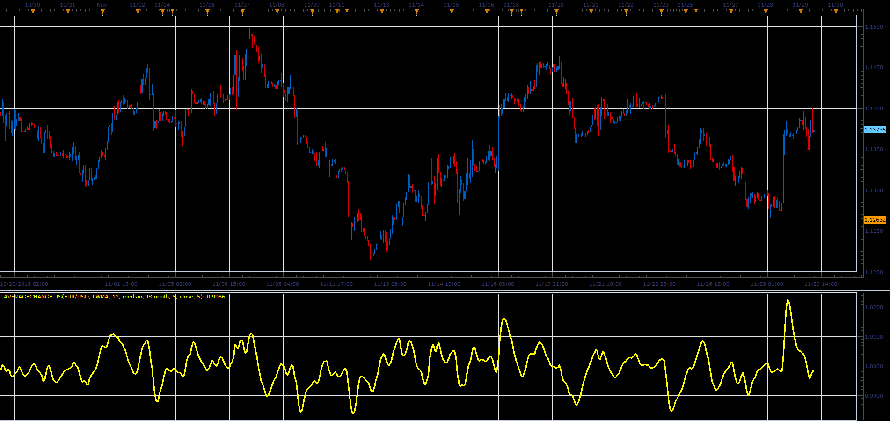

# Average change indicator

> Source: https://fxcodebase.com/code/viewtopic.php?f=48&t=67074  
> Forum: 48 · Topic 67074 · 1 post(s)

---

## Average change indicator

**Alexander.Gettinger** · Fri Dec 07, 2018 1:26 pm

Formulas:
Average change = MA2(Ratio), where
Ratio = (Price/MA1(Price))^Power.

 

Download:

 [AverageChange_JS.jsl](files/122583/AverageChange_JS.jsl)

For this indicator must be installed Averages indicator ([viewtopic.php?f=17&t=2430](https://fxcodebase.com/code/viewtopic.php?f=17&t=2430)).
