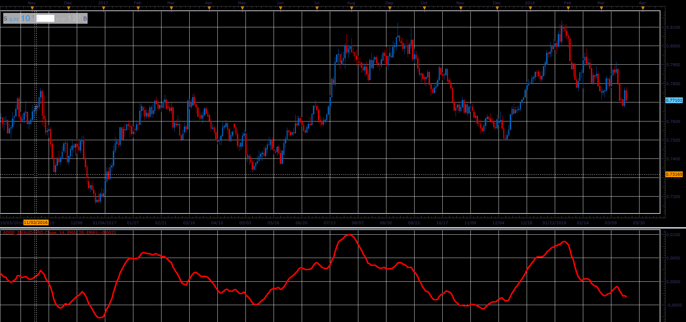

# Average Detrended Synthetic Price

> Source: https://fxcodebase.com/code/viewtopic.php?f=48&t=65897  
> Forum: 48 · Topic 65897 · 1 post(s)

---

## Average Detrended Synthetic Price

**Alexander.Gettinger** · Wed Apr 11, 2018 1:46 pm

Formula:
DSP = MA(Length, Method, Price)-MA(2*Length, Method, Price).

 

Download:

 [ADSP_JS.jsl](files/118560/ADSP_JS.jsl)
