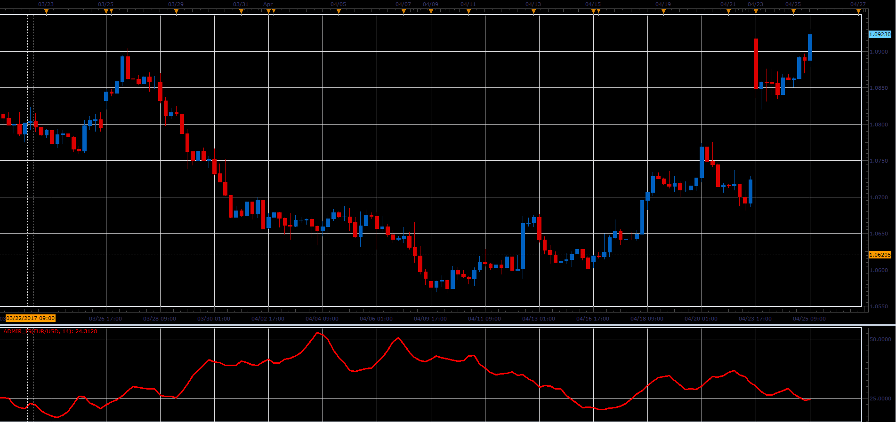

# Average Directional Movement Index Rating

> Source: https://fxcodebase.com/code/viewtopic.php?f=48&t=64763  
> Forum: 48 · Topic 64763 · 1 post(s)

---

## Average Directional Movement Index Rating

**Alexander.Gettinger** · Mon Jun 05, 2017 12:15 pm

Formula:
ADMIR[i] = (ADX[i] + ADX[i-Difference])/2.

 

Download:

 [ADMIR_JS.jsl](files/112774/ADMIR_JS.jsl)
