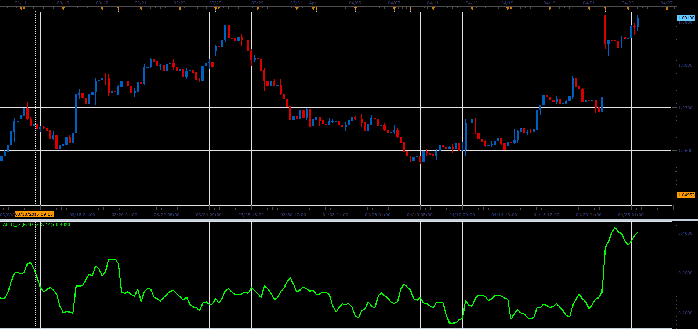

# Average Percentage True Range

> Source: https://fxcodebase.com/code/viewtopic.php?f=48&t=64680  
> Forum: 48 · Topic 64680 · 1 post(s)

---

## Average Percentage True Range

**Alexander.Gettinger** · Fri May 26, 2017 2:05 pm

Formula:
APTR = MVA(PTR) with [Period] number of periods,
PTR - maximum value for S1, S2, S3, where
S1 = 2*(High[i]-Low[i])/(High[i]+Low[i]),
S2 = 2*(High[i]-Close[i-1])/(High[i]+Close[i-1]),
S3 = 2*(Low[i]-Close[i-1])/(3*Low[i]-Close[i-1]).

 

Download:

 [APTR_JS.jsl](files/112559/APTR_JS.jsl)
