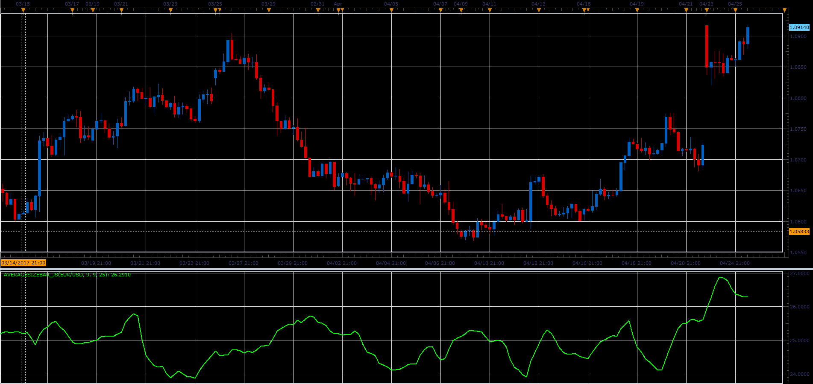

# Average size of bars

> Source: https://fxcodebase.com/code/viewtopic.php?f=48&t=64700  
> Forum: 48 · Topic 64700 · 1 post(s)

---

## Average size of bars

**Alexander.Gettinger** · Fri Jun 02, 2017 11:56 am

The indicator shows the average bar size (High-Low).

 

Download:

 [AverageSizeBar_JS.jsl](files/112689/AverageSizeBar_JS.jsl)
