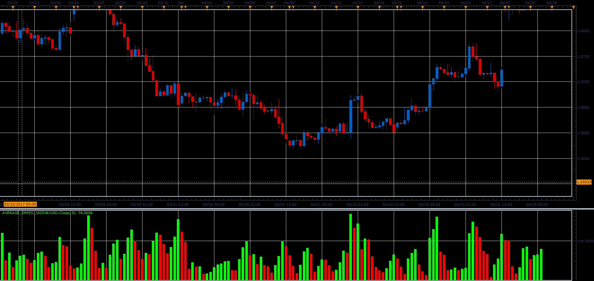

# Average Speed

> Source: https://fxcodebase.com/code/viewtopic.php?f=48&t=64699  
> Forum: 48 · Topic 64699 · 4 post(s)

---

## Average Speed

**Alexander.Gettinger** · Fri Jun 02, 2017 11:54 am

The indicator shows the average speed of price change.

 

Download:

 [Average_Speed_JS.jsl](files/112688/Average_Speed_JS.jsl)

---

## Re: Average Speed

**mayk01** · Tue Jun 25, 2024 2:48 pm

Hi,
is it possible to request an alert level?
Best regards,
M.

---

## Re: Average Speed

**Apprentice** · Tue Jul 02, 2024 3:34 pm

We have added your request to the development list.
Development reference 536

---

## Re: Average Speed

**Apprentice** · Mon Aug 05, 2024 3:11 am

Try Average_Speed with Alert.lua
[https://fxcodebase.com/code/viewtopic.p ... 24#p156324](https://fxcodebase.com/code/viewtopic.php?f=17&t=32557&p=156324#p156324)
