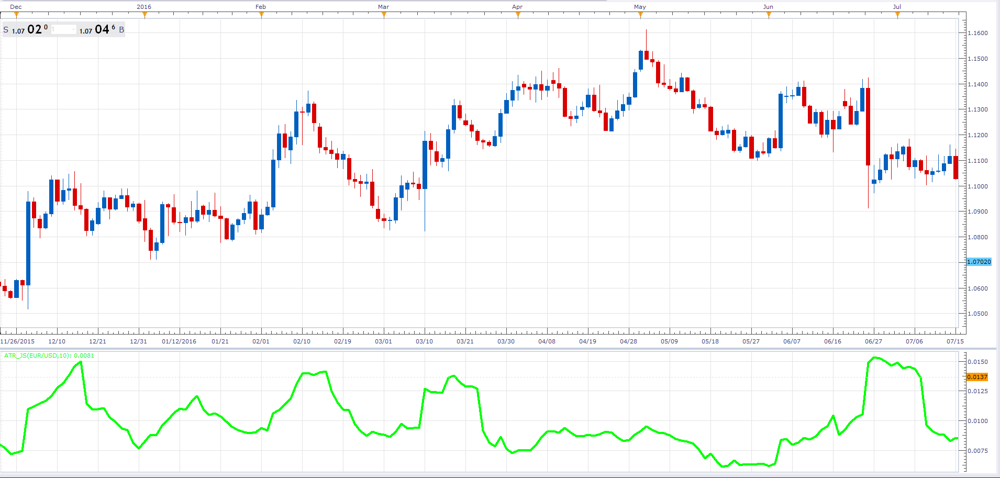

# Average True Range

> Source: https://fxcodebase.com/code/viewtopic.php?f=48&t=64353  
> Forum: 48 · Topic 64353 · 1 post(s)

---

## Average True Range

**Alexander.Gettinger** · Fri Jan 27, 2017 11:45 am

Average True Range Indicator (ATR) is an indicator that shows volatility of the market. It was introduced by Welles Wilder in his book "New concepts in technical trading systems".

 

Download:

 [ATR_JS.jsl](files/110745/ATR_JS.jsl)
