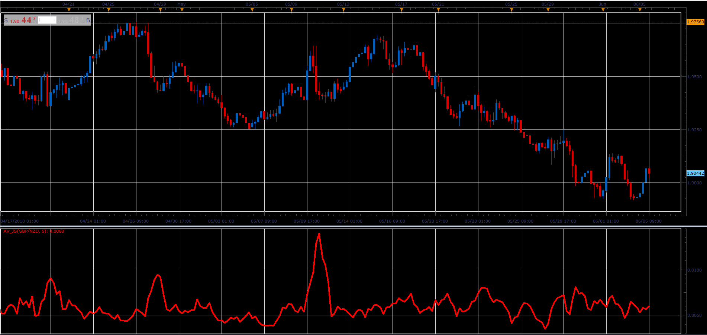

# Average Volatility

> Source: https://fxcodebase.com/code/viewtopic.php?f=48&t=66427  
> Forum: 48 · Topic 66427 · 1 post(s)

---

## Average Volatility

**Alexander.Gettinger** · Mon Aug 06, 2018 1:37 pm

Formula:
AV = MVA(Volatility) with [Length] number of periods, where
Volatility = High - Low.

 

Download:

 [AV_JS.jsl](files/120354/AV_JS.jsl)
