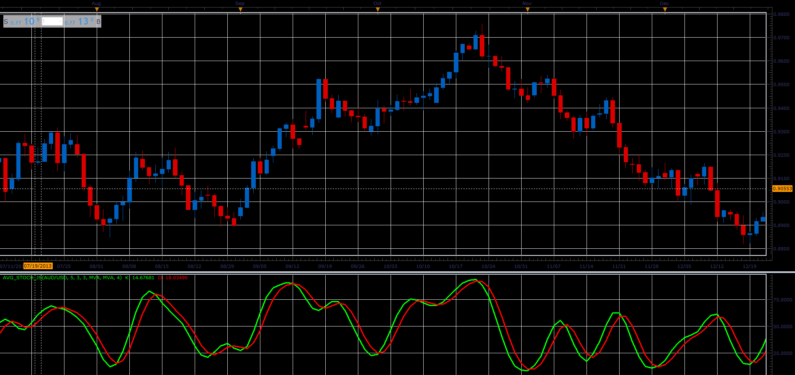

# Averaged stochastic oscillator

> Source: https://fxcodebase.com/code/viewtopic.php?f=48&t=65909  
> Forum: 48 · Topic 65909 · 1 post(s)

---

## Averaged stochastic oscillator

**Alexander.Gettinger** · Wed Apr 11, 2018 2:02 pm

The indicator shows the average values ​​of the stochastic.

Formulas:
K = MVA(Stochastic.K, Avg. period),
D = MVA(Stochastic.D, Avg. period).

 

Download:

 [Avg_Stoch_JS.jsl](files/118572/Avg_Stoch_JS.jsl)
