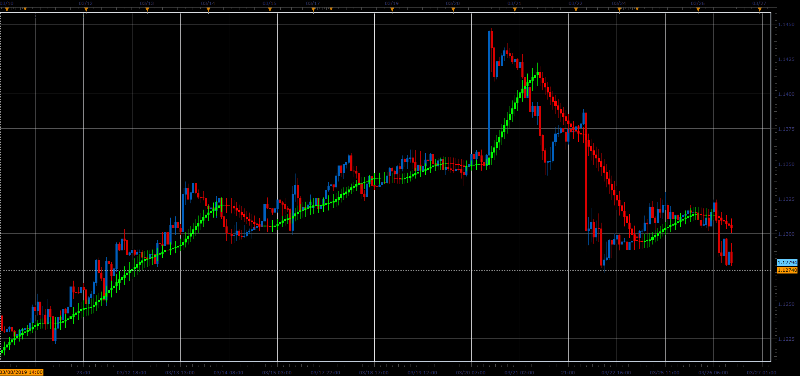

# Averages candle indicator

> Source: https://fxcodebase.com/code/viewtopic.php?f=48&t=68201  
> Forum: 48 · Topic 68201 · 1 post(s)

---

## Averages candle indicator

**Alexander.Gettinger** · Sat Mar 30, 2019 11:11 am

Moving average as candle.
Open of candle is a MA for open price and etc.

 

Download:

 [Averages_Candle_JS.jsl](files/125420/Averages_Candle_JS.jsl)

For this indicator must be installed AVERAGES indicator ([viewtopic.php?f=17&t=2430](https://fxcodebase.com/code/viewtopic.php?f=17&t=2430)).
