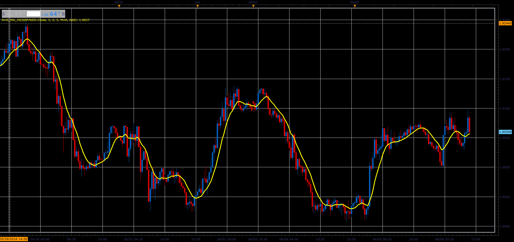

# Avg_MA indicator

> Source: https://fxcodebase.com/code/viewtopic.php?f=48&t=66512  
> Forum: 48 · Topic 66512 · 1 post(s)

---

## Avg_MA indicator

**Alexander.Gettinger** · Wed Aug 15, 2018 2:10 pm

The indicator is a average value from several MA.

For example:
if first period=5,
K=2,
Count of MA=5
Avg_MA=(MA(5)+MA(7)+MA(9)+MA(11)+MA(13))/5.

 

Download:

 [Avg_MA_JS.jsl](files/120574/Avg_MA_JS.jsl)
