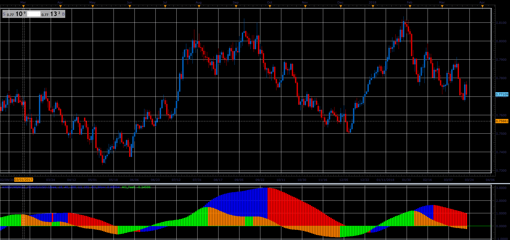

# Awesome Modified

> Source: https://fxcodebase.com/code/viewtopic.php?f=48&t=65910  
> Forum: 48 · Topic 65910 · 1 post(s)

---

## Awesome Modified

**Alexander.Gettinger** · Wed Apr 11, 2018 2:03 pm

Formulas:
AO_Fast = MVA(100*(Short_EMA/Medium_EMA-1), AO_Fast_Length),
AO_Slow = MVA(100*(Medium_EMA/Long_EMA-1), AO_Slow_Length).

 

Download:

 [AwesomeMod_JS.jsl](files/118573/AwesomeMod_JS.jsl)
