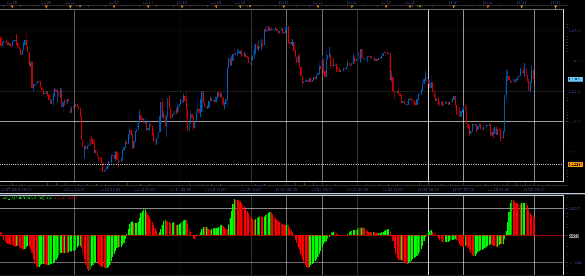

# Awesome Oscillator

> Source: https://fxcodebase.com/code/viewtopic.php?f=48&t=67071  
> Forum: 48 · Topic 67071 · 1 post(s)

---

## Awesome Oscillator

**Alexander.Gettinger** · Fri Dec 07, 2018 1:20 pm

Awesome Oscillator (AO) is the difference between the 34 period and 5 period simple moving averages of the candle’s/ bar’s middle points. Basically: (High+Low) / 2.

AO Indicator calculates and determines market momentum at a given time when comparing the last five bars to last thirty four bars.

Awesome Oscillator (AO) is displayed on the chart as a histogram. Awesome Oscillator can present us with three buy signals and also three sell signals, but its not recommended to use them until the first fractal buy or sell signal is triggered outside the Alligator's mouth.

CALCULATION:

MEDIAN = (HIGH+LOW)/2
AO = MVA(MEDIAN, 5) - MVA(MEDIAN, 34)

 

Download:

 [AO_JS.jsl](files/122580/AO_JS.jsl)
