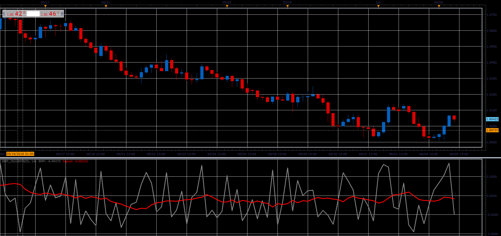

# Balance of Market Power

> Source: https://fxcodebase.com/code/viewtopic.php?f=48&t=66429  
> Forum: 48 · Topic 66429 · 1 post(s)

---

## Balance of Market Power

**Alexander.Gettinger** · Mon Aug 06, 2018 1:45 pm

The Balance of Market Power indicator, presented by Igor Livshin in his article "Balance of Market Power".

Formulas:
BMP = (BuO+BuC+BuOC)/3-(BeO+BeC+BeOC)/3,
Signal = MVA(BMP) with [Length] number of periods, where
BuO = (High-Low)/THL,
BeO = (Open-Low)/THL,
BuC = (Close-Low)/THL,
BeC = (High-Close)/THL,
BuOC = (Close-Open)/THL, if Close>Open, else BuOC = 0,
BeOC = (Open-Close)/THL, if Close<Open, else BeOC = 0,
THL = High-Low.

 

Download:

 [BMP_JS.jsl](files/120359/BMP_JS.jsl)
