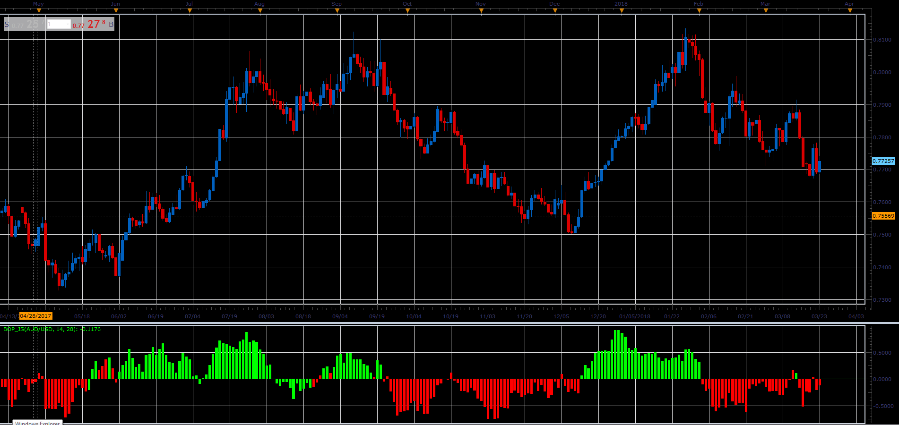

# Balance of Power

> Source: https://fxcodebase.com/code/viewtopic.php?f=48&t=65922  
> Forum: 48 · Topic 65922 · 1 post(s)

---

## Balance of Power

**Alexander.Gettinger** · Thu Apr 12, 2018 11:53 am

Formula:
BOP[i] = (Close[i] - Open[i-Price_Action+1])/(Max-Min), where
Max, Min - maximum and minimum prices at range from (i-Range_Length+1) to (i).

 

Download:

 [BOP_JS.jsl](files/118636/BOP_JS.jsl)
