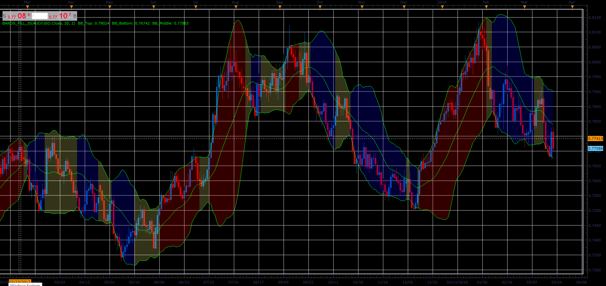

# Bands fill indicator

> Source: https://fxcodebase.com/code/viewtopic.php?f=48&t=65911  
> Forum: 48 · Topic 65911 · 1 post(s)

---

## Bands fill indicator

**Alexander.Gettinger** · Wed Apr 11, 2018 2:04 pm

The indicator is a bollinger bands painted as follows.
If the price crosses the top band of the indicator is colored in UP color.
If the price crosses the bottom band of the indicator is colored in DN color.
If the price crosses the middle line of the indicator is colored in neutral color.

 

Download:

 [Bands_Fill_JS.jsl](files/118574/Bands_Fill_JS.jsl)
