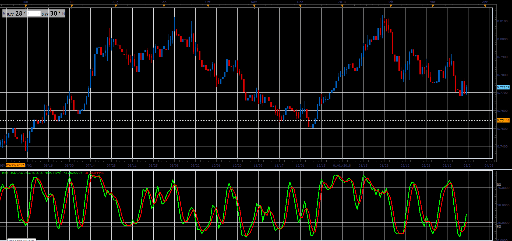

# Bar Based Stochastic

> Source: https://fxcodebase.com/code/viewtopic.php?f=48&t=65914  
> Forum: 48 · Topic 65914 · 1 post(s)

---

## Bar Based Stochastic

**Alexander.Gettinger** · Wed Apr 11, 2018 2:07 pm

Formulas:
K = MA(FastK) with [D_Slowing] number of periods and [K_Smoothing_Method] type,
D = MA(K) with [D_Length] number of periods and [D_Smoothing_Method] type, where
FastK[i] = 100*mins[i]/maxes[i],
mins[i] = Close[i]-minLow,
maxes[i] = maxHigh-minLow,
minLow, maxHigh - minimum and maximum prices at range from (i-K_Length+1) to (i).

 

Download:

 [BBS_JS.jsl](files/118577/BBS_JS.jsl)
