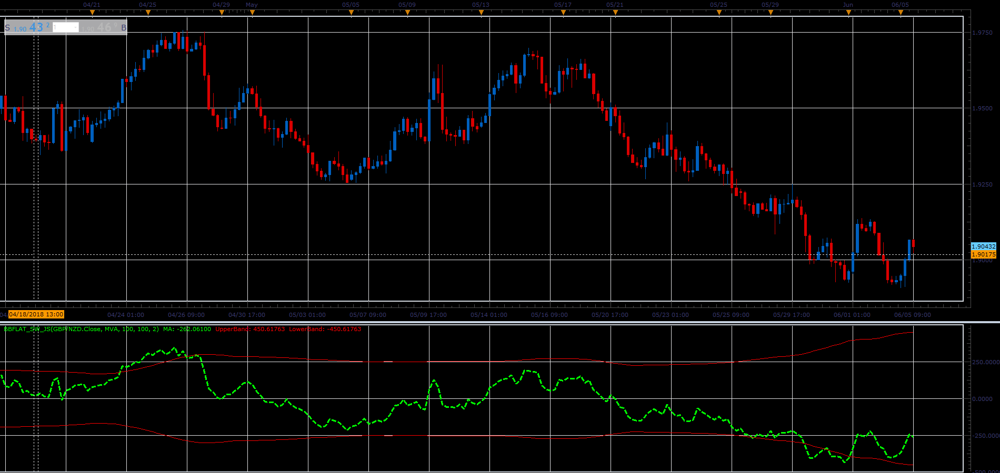

# BB flat oscillator

> Source: https://fxcodebase.com/code/viewtopic.php?f=48&t=66428  
> Forum: 48 · Topic 66428 · 1 post(s)

---

## BB flat oscillator

**Alexander.Gettinger** · Mon Aug 06, 2018 1:44 pm

Formulas:
MA[i] = Price[i] - Moving average[i],
Upper band, Lower band - range of bollinger bands.

 

Download:

 [BBflat_sw_JS.jsl](files/120358/BBflat_sw_JS.jsl)

For this indicator must be installed Averages indicator ([viewtopic.php?f=17&t=2430](https://fxcodebase.com/code/viewtopic.php?f=17&t=2430)).
