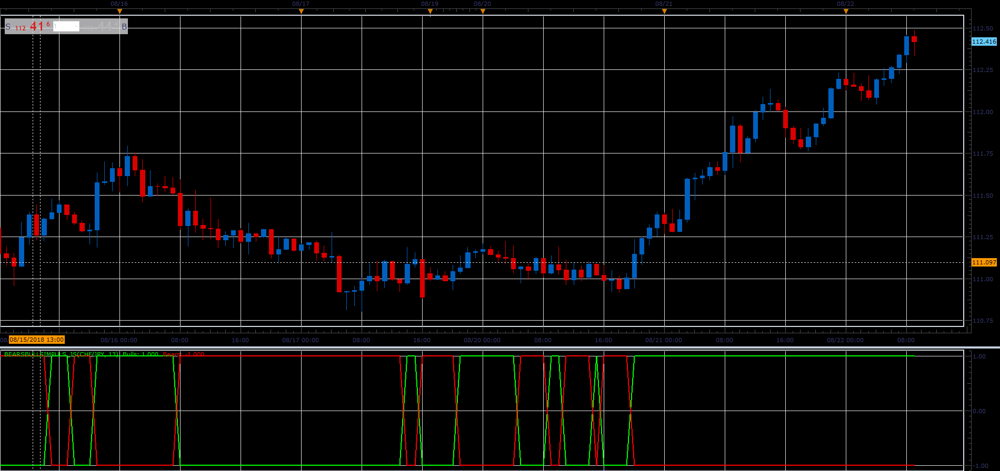

# Bears Bulls Impuls

> Source: https://fxcodebase.com/code/viewtopic.php?f=48&t=66960  
> Forum: 48 · Topic 66960 · 1 post(s)

---

## Bears Bulls Impuls

**Alexander.Gettinger** · Sat Nov 24, 2018 12:08 pm

Indicator is based on the Elder-Rays Bulls & Bears Power indicators.

Formulas:
Bulls = 1 and Bears = -1, if BullIndex+BearIndex>0,
Bulls = -1 and Bears = 1, if BullIndex+BearIndex<0, where
BullIndex = High - EMA(Price),
BearIndex = Low - EMA(Price).

 

Download:

 [BearsBullsImpuls_JS.jsl](files/122288/BearsBullsImpuls_JS.jsl)
