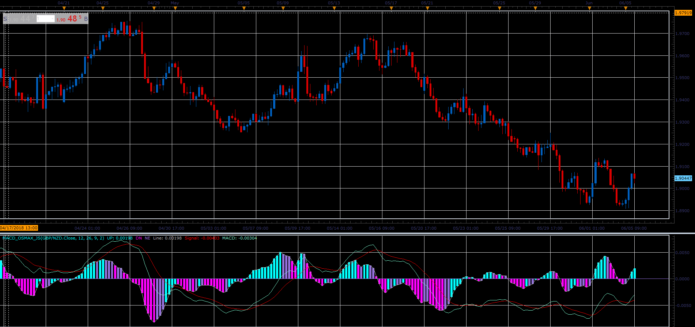

# Best MACD final

> Source: https://fxcodebase.com/code/viewtopic.php?f=48&t=66439  
> Forum: 48 · Topic 66439 · 1 post(s)

---

## Best MACD final

**Alexander.Gettinger** · Mon Aug 06, 2018 2:01 pm

Moving Average of Oscillator (OsMA), is an indicator that is calculated by taking the difference between a shorter-term moving average and a longer-term moving average. The two most common are the 12 period moving average and the 26 period moving averages. Because of this fact, it is best described as a modification of the classic MACD Indicator.

 

Download:

 [MACD_Osmax_JS.jsl](files/120371/MACD_Osmax_JS.jsl)
