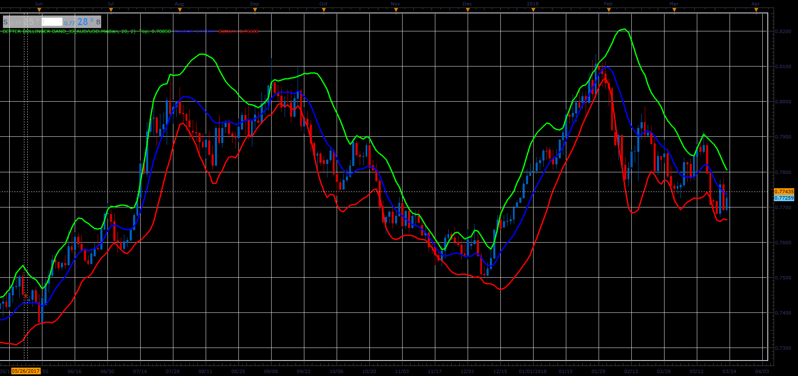

# Better Bollinger Band

> Source: https://fxcodebase.com/code/viewtopic.php?f=48&t=65915  
> Forum: 48 · Topic 65915 · 1 post(s)

---

## Better Bollinger Band

**Alexander.Gettinger** · Wed Apr 11, 2018 2:08 pm

In the October 1998 issue of "Futures" there is an article written by Dennis McNicholl called "Better Bollinger Bands", in which the author recommends improving BB by modifying:
- the center line formula &
- different equations for calculating the bands.

These bands, called "DEnvelope", follow price more closely and respond faster to changes in volatility with these modifications.

 

Download:

 [Better Bollinger Band_JS.jsl](files/118578/Better%20Bollinger%20Band_JS.jsl)
