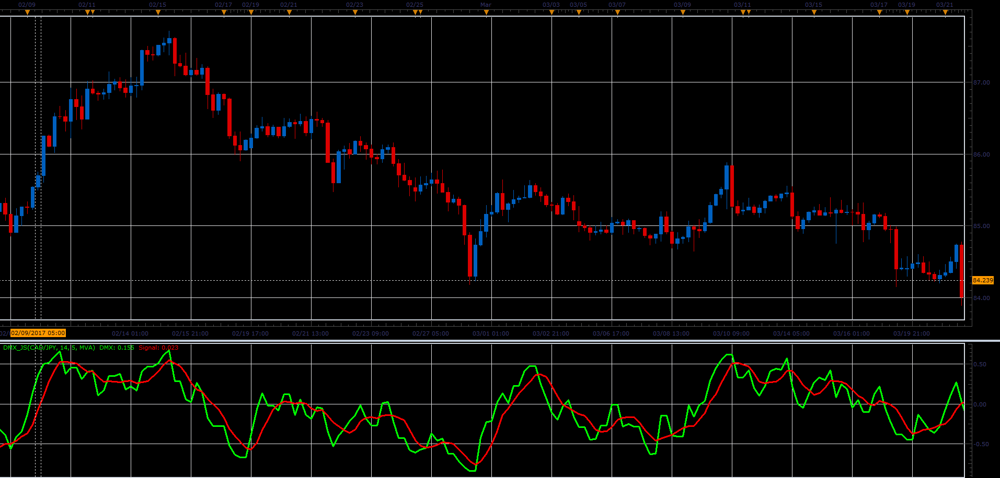

# Bipolar DMI (DMX)

> Source: https://fxcodebase.com/code/viewtopic.php?f=48&t=64771  
> Forum: 48 · Topic 64771 · 1 post(s)

---

## Bipolar DMI (DMX)

**Alexander.Gettinger** · Tue Jun 06, 2017 1:44 pm

Formulas:
DMX = (P-M)/(P+M),
Signal = MA(DMX) with [Smoothing_Length] number of periods and [Smoothing_Method] type, where
P - (+DI) mode of ADX indicator,
M - (-DI) mode of ADX indicator.

 

Download:

 [DMX_JS.jsl](files/112790/DMX_JS.jsl)
