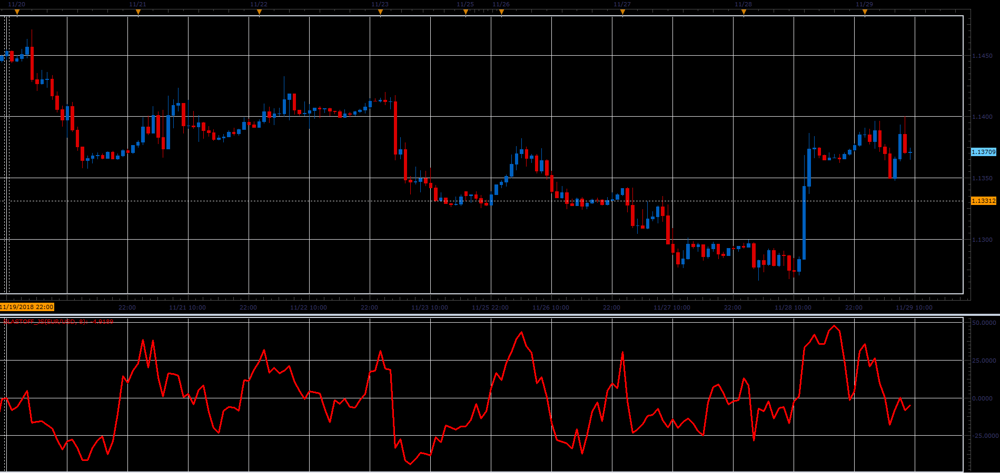

# Blast Off

> Source: https://fxcodebase.com/code/viewtopic.php?f=48&t=67077  
> Forum: 48 · Topic 67077 · 1 post(s)

---

## Blast Off

**Alexander.Gettinger** · Fri Dec 07, 2018 1:40 pm

Larry Williams shared a method that he uses to determine when a trading instrument is ready to make a big move. He calls it Blast Off. He compares the Open and Close verses the High and Low of the day. If the difference between the open and close of the day is less than 20% of the range of the day, then it's likely that the next day will be a pretty good size move.

MovingAvg(Abs(Close-Open, X days) /MovingAvg((High- Low),X days)*100

 

Download:

 [BlastOff_JS.jsl](files/122586/BlastOff_JS.jsl)
