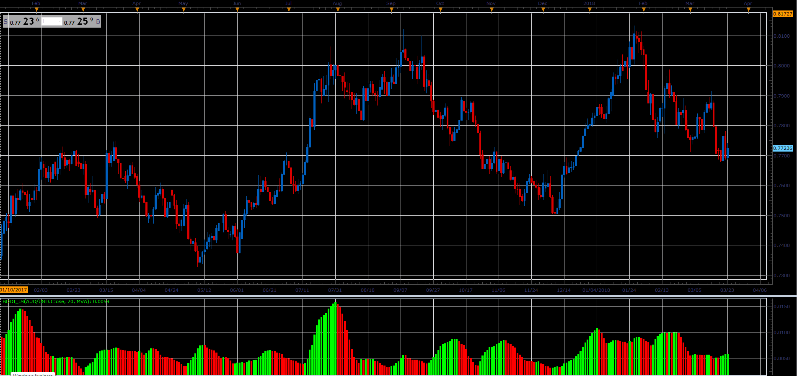

# BoDi indicator

> Source: https://fxcodebase.com/code/viewtopic.php?f=48&t=65920  
> Forum: 48 · Topic 65920 · 1 post(s)

---

## BoDi indicator

**Alexander.Gettinger** · Thu Apr 12, 2018 11:51 am

Indicator described in Forex Magazine issue #438.

Formula:
BoDi[i]=sqrt(S/Period), where
S - sum (Price[i-k]-MA[i]) for k from 0 to (Period-1).

 

Download:

 [BoDi_JS.jsl](files/118634/BoDi_JS.jsl)

For this indicator must be installed Averages indicator ([viewtopic.php?f=17&t=2430](https://fxcodebase.com/code/viewtopic.php?f=17&t=2430)).
