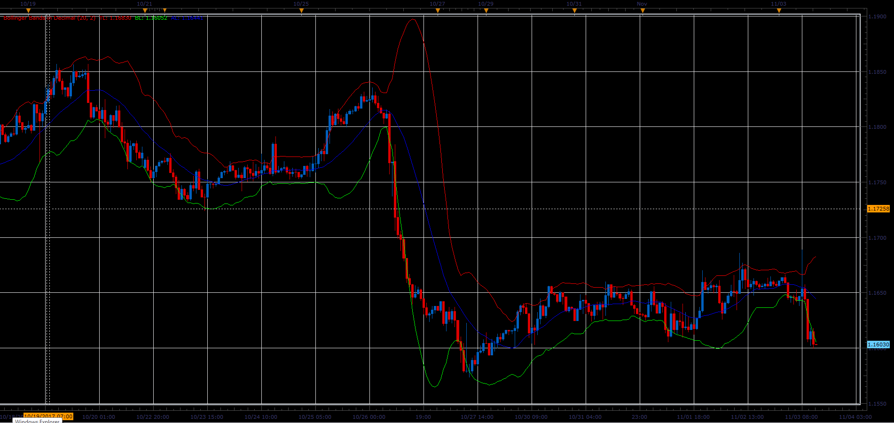
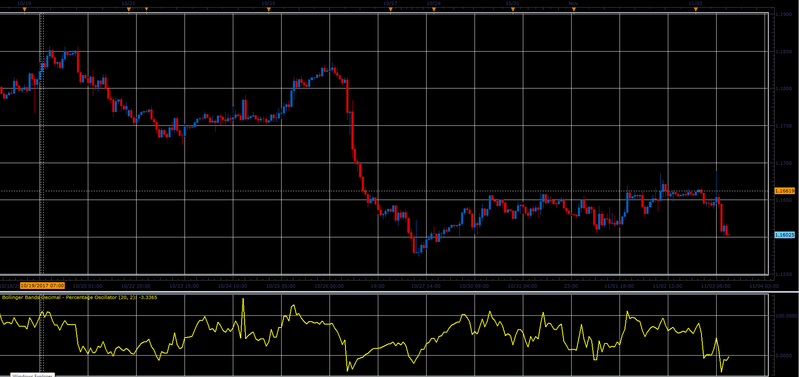
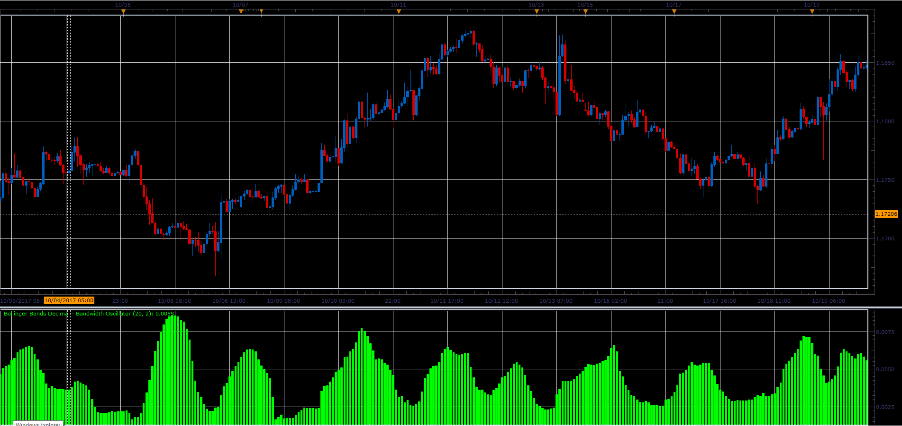
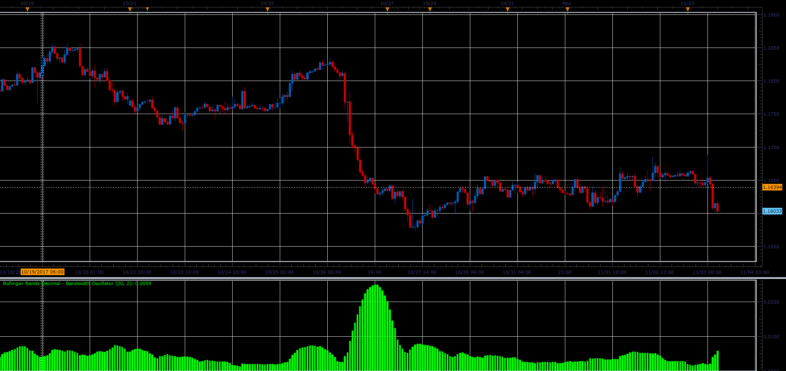
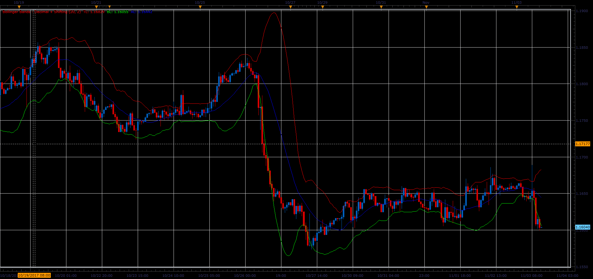
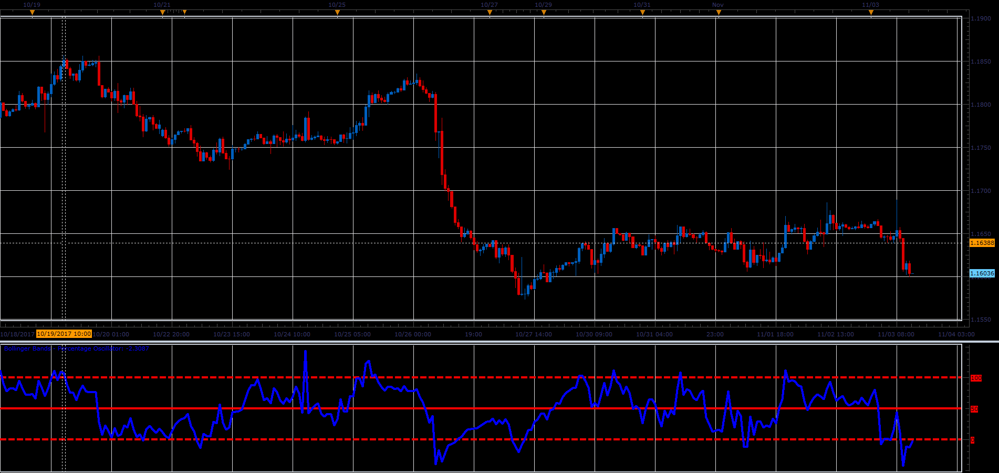

# Bollinger Bands Decimal - Original, Percentage, Bandwidth

> Source: https://fxcodebase.com/code/viewtopic.php?f=48&t=65522  
> Forum: 48 · Topic 65522 · 1 post(s)

---

## Bollinger Bands Decimal - Original, Percentage, Bandwidth

**Alexander.Gettinger** · Sat Jan 06, 2018 12:29 pm

**Bollinger Bands Decimal.**

 

Download:

 [BB-Decimal_JS.jsl](files/116801/BB-Decimal_JS.jsl)

**Bollinger Bands Percentage Decimal.**

 

Download:

 [BB-Percentages-Decimal_JS.jsl](files/116801/BB-Percentages-Decimal_JS.jsl)

**Bollinger Bands Decimal.**
BAND = ((TL - BL) / CL);

 

Download:

 [BB-Bandwidth-Decimal_JS.jsl](files/116801/BB-Bandwidth-Decimal_JS.jsl)

**Bollinger Bands Bandwidth with Simple Bollinger Bands Bandwidth option**
BAND = (TL - BL)

 

Download:

 [BB-Bandwidth_JS.jsl](files/116801/BB-Bandwidth_JS.jsl)

**Bollinger Bands Decimal with shifting**

 

Download:

 [BB-Decimal-WITH-Shifting_JS.jsl](files/116801/BB-Decimal-WITH-Shifting_JS.jsl)

**Bollinger Bands Percentage**

 

Download:

 [BB-Percentages_JS.jsl](files/116801/BB-Percentages_JS.jsl)
