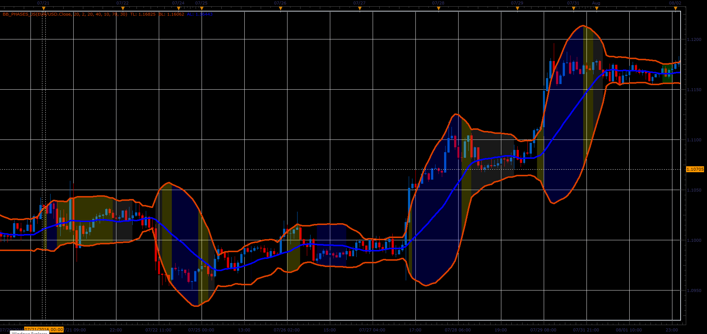

# Bollinger Bands Phases indicator

> Source: https://fxcodebase.com/code/viewtopic.php?f=48&t=65524  
> Forum: 48 · Topic 65524 · 4 post(s)

---

## Bollinger Bands Phases indicator

**Alexander.Gettinger** · Sat Jan 06, 2018 12:35 pm

Download:

 [BB_Phases_JS.jsl](files/116803/BB_Phases_JS.jsl)

TS2/Lua version.
[viewtopic.php?f=17&t=70142](https://fxcodebase.com/code/viewtopic.php?f=17&t=70142)

---

## Re: Bollinger Bands Phases indicator

**Gilles** · Sun Jul 05, 2020 2:40 pm

Hi Alexander,

Please, a LUA version.
Thank you very much :)
See you soon :)!

---

## Re: Bollinger Bands Phases indicator

**Apprentice** · Mon Jul 06, 2020 11:31 am

Your request is added to the development list.
Development reference 1639.

---

## Re: Bollinger Bands Phases indicator

**Apprentice** · Wed Jul 08, 2020 5:42 am

TS2/Lua version.
[viewtopic.php?f=17&t=70142](https://fxcodebase.com/code/viewtopic.php?f=17&t=70142)
