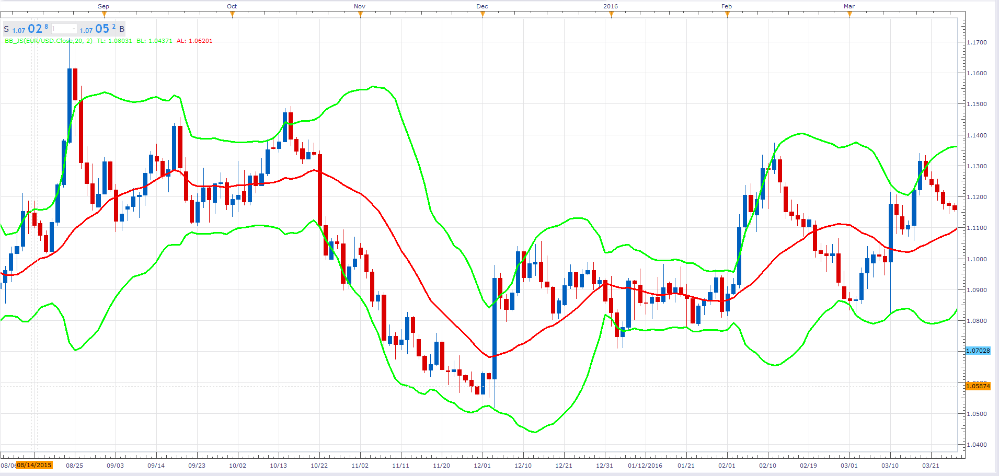

# Bollinger Bands

> Source: https://fxcodebase.com/code/viewtopic.php?f=48&t=64354  
> Forum: 48 · Topic 64354 · 1 post(s)

---

## Bollinger Bands

**Alexander.Gettinger** · Fri Jan 27, 2017 11:48 am

Bollinger bands (BB) are formed by three lines. The middle line is a usual Moving Average.
The top line is the same as the middle line a certain number of standard deviations higher than the middle line.
The bottom line is the middle line shifted down by the same number of standard deviations.

 

Download:

 [BB_JS.jsl](files/110746/BB_JS.jsl)
