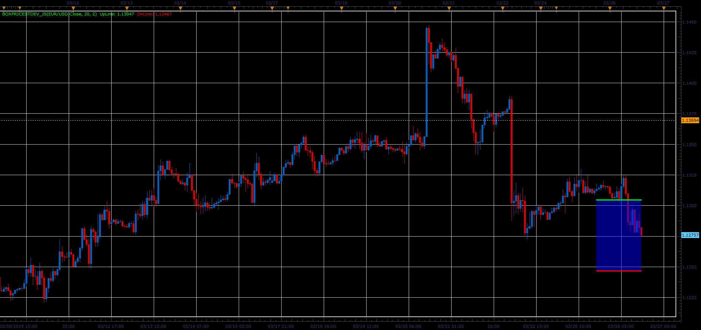

# Box price indicator

> Source: https://fxcodebase.com/code/viewtopic.php?f=48&t=68254  
> Forum: 48 · Topic 68254 · 5 post(s)

---

## Box price indicator

**Alexander.Gettinger** · Sat Mar 30, 2019 3:19 pm

Indicator draw lines above and below the current price and cloud between them.

 

Download:

 [BoxPriceStDev_JS.jsl](files/125474/BoxPriceStDev_JS.jsl)

MT4/MQ4 version.
[viewtopic.php?f=38&t=69228](https://fxcodebase.com/code/viewtopic.php?f=38&t=69228)

---

## Re: Box price indicator

**magtrad** · Wed Dec 11, 2019 3:21 pm

Dear
this is great website!
May I ask you to develop this box price indicato for mt4?
thanks!

---

## Re: Box price indicator

**Apprentice** · Wed Dec 11, 2019 5:51 pm

Your request is added to the development list.
Development reference 427.

---

## Re: Box price indicator

**Apprentice** · Thu Dec 12, 2019 5:30 pm

MT4/MQ4 version.
[viewtopic.php?f=38&t=69228](https://fxcodebase.com/code/viewtopic.php?f=38&t=69228)

---

## Re: Box price indicator

**magtrad** · Tue Dec 17, 2019 10:32 am

thank you very much
