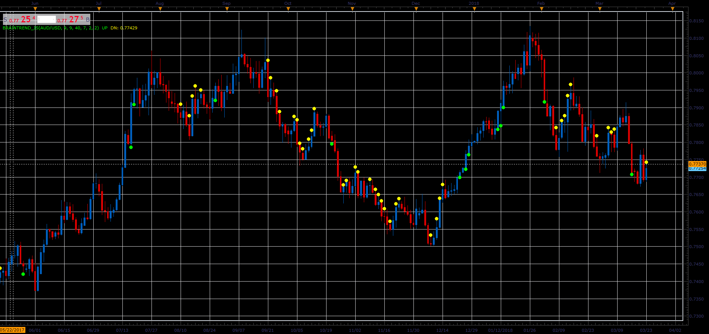

# Brain trend indicator

> Source: https://fxcodebase.com/code/viewtopic.php?f=48&t=65923  
> Forum: 48 · Topic 65923 · 1 post(s)

---

## Brain trend indicator

**Alexander.Gettinger** · Thu Apr 12, 2018 11:54 am

The indicator show up/down trends.

Formulas:
for DOWN trend must be:
Stochastic K<[Stochastic Level] and ABS(Close[i]-Close[i-Shift])>ATR/Range

for UP trend must be:
Stochastic K>1-[Stochastic Level] and ABS(Close[i]-Close[i-Shift])>ATR/Range

 

Download:

 [BrainTrend_JS.jsl](files/118637/BrainTrend_JS.jsl)
