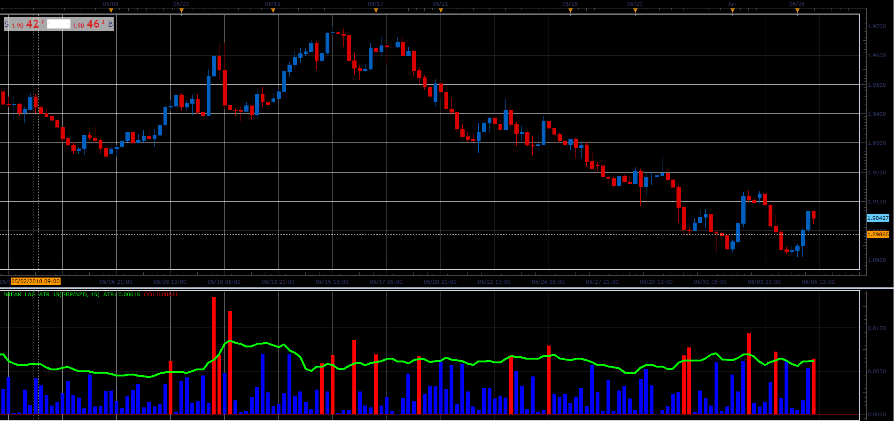

# Break Lag ATR

> Source: https://fxcodebase.com/code/viewtopic.php?f=48&t=66430  
> Forum: 48 · Topic 66430 · 1 post(s)

---

## Break Lag ATR

**Alexander.Gettinger** · Mon Aug 06, 2018 1:47 pm

Formulas:
ATR[i]=ATR[i-1]+(TR[i]-TR[i-Period])/Period, where
TR[i]=Max(High[i],Close[i-1])-Min(Low[i],Close[i-1]),
CO[i]=Abs(Close[i-1]-Open[i-1]).

 

Download:

 [Break_Lag_ATR_JS.jsl](files/120360/Break_Lag_ATR_JS.jsl)
