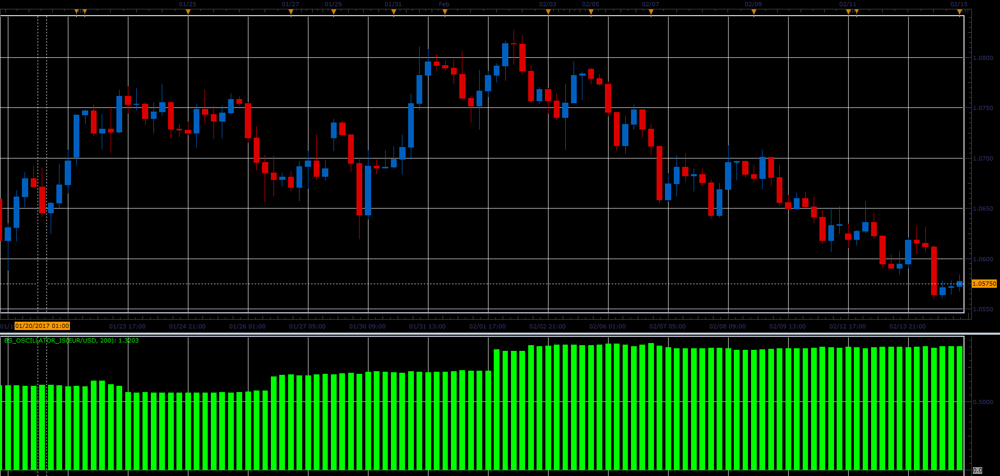

# BS oscillator

> Source: https://fxcodebase.com/code/viewtopic.php?f=48&t=64702  
> Forum: 48 · Topic 64702 · 1 post(s)

---

## BS oscillator

**Alexander.Gettinger** · Fri Jun 02, 2017 12:05 pm

Formula:
BS = StdDev(PA)/StdDev(NA), where
StdDev - standard deviation,
PA, NA - positive and negative candle body size (Close-Open).

 

Download:

 [BS_Oscillator_JS.jsl](files/112691/BS_Oscillator_JS.jsl)
