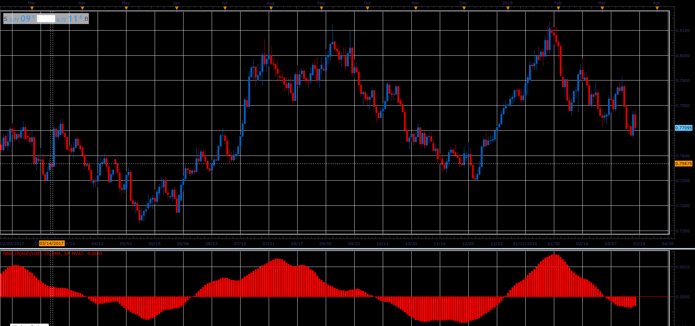

# Bull And Bear Balance Indicator

> Source: https://fxcodebase.com/code/viewtopic.php?f=48&t=65912  
> Forum: 48 · Topic 65912 · 4 post(s)

---

## Bull And Bear Balance Indicator

**Alexander.Gettinger** · Wed Apr 11, 2018 2:05 pm

As described in an article "Bull And Bear Balance Indicator" by Vadim Gimelfarb.
Indicator analyzes the balance between bullish and bearish sentiment.

 

Download:

 [BBB_JS.jsl](files/118575/BBB_JS.jsl)

---

## Re: Bull And Bear Balance Indicator

**MemphisRokudo** · Sat Jan 12, 2019 10:09 pm

Is there a mt4 version with pushnotify crossing zero?

---

## Re: Bull And Bear Balance Indicator

**Apprentice** · Sun Jan 13, 2019 7:41 am

Your request is added to the development list under Id Number 4418

---

## Re: Bull And Bear Balance Indicator

**Alexander.Gettinger** · Tue Jan 15, 2019 4:38 pm

Please try this indicator:

 [BBB.mq4](files/123374/BBB.mq4)
