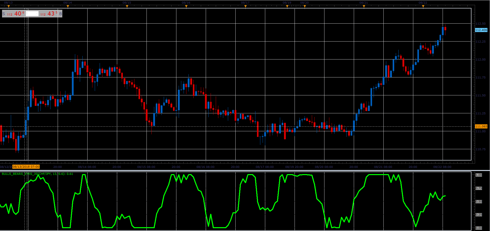

# Bulls-Bears eyes oscillator

> Source: https://fxcodebase.com/code/viewtopic.php?f=48&t=66962  
> Forum: 48 · Topic 66962 · 1 post(s)

---

## Bulls-Bears eyes oscillator

**Alexander.Gettinger** · Sat Nov 24, 2018 12:12 pm

Indicator values ​​are calculated as the sum of the indicators Bears Power and Bulls Power, averaged with an algorithm Laguerre.

 

Download:

 [Bulls_Bears_Eyes_JS.jsl](files/122290/Bulls_Bears_Eyes_JS.jsl)

For this oscillator must be installed Bear Power and Bull Power ([viewtopic.php?f=17&t=1376&p=2648](https://fxcodebase.com/code/viewtopic.php?f=17&t=1376&p=2648)).
