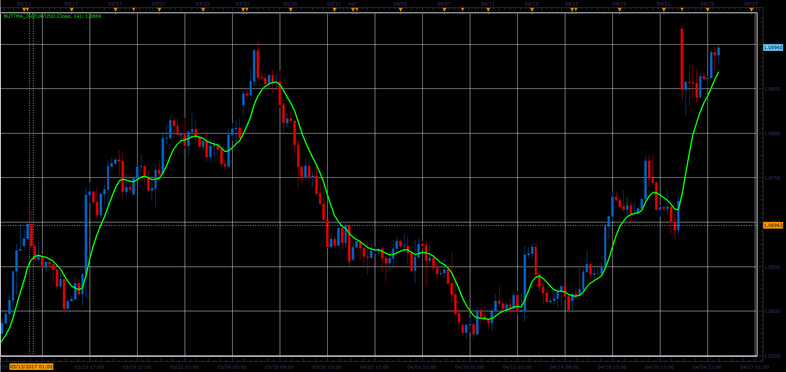

# Butterworth Moving Average

> Source: https://fxcodebase.com/code/viewtopic.php?f=48&t=64703  
> Forum: 48 · Topic 64703 · 1 post(s)

---

## Butterworth Moving Average

**Alexander.Gettinger** · Fri Jun 02, 2017 12:07 pm

Formula:
ButtMA[i] = p1*Price[i]+p2*Price[i-1]-p3*Price[i-2], where
p1 = 2/(1+Period),
p2 = 2*(1-Kf),
p3 = (1-Kf)*(1-Kf),
Kf = Sqrt(p1),
Period - number of periods.

 

Download:

 [ButtMA_JS.jsl](files/112692/ButtMA_JS.jsl)
