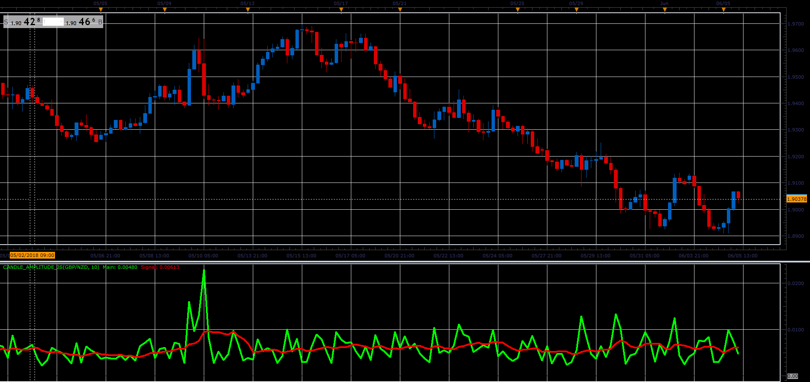

# Candle amplitude indicator

> Source: https://fxcodebase.com/code/viewtopic.php?f=48&t=66431  
> Forum: 48 · Topic 66431 · 1 post(s)

---

## Candle amplitude indicator

**Alexander.Gettinger** · Mon Aug 06, 2018 1:49 pm

Indicator have a 2 mode:
1. show High-Low
2. show Close-Open.

In addition indicator draw average value as a signal line.

 

Download:

 [Candle_Amplitude_JS.jsl](files/120361/Candle_Amplitude_JS.jsl)
