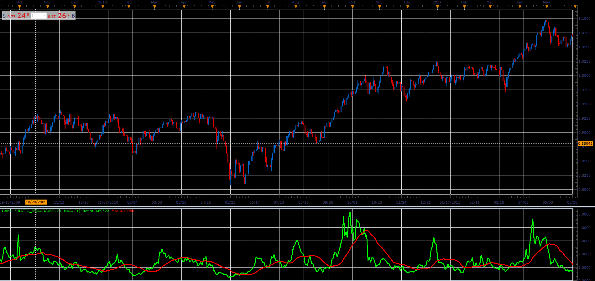

# Candle Ratio indicator

> Source: https://fxcodebase.com/code/viewtopic.php?f=48&t=65925  
> Forum: 48 · Topic 65925 · 1 post(s)

---

## Candle Ratio indicator

**Alexander.Gettinger** · Thu Apr 12, 2018 11:57 am

Up Candle
Up=close-open;
Down =0;

Down Candle
Down=open-close;
Up = 0;
Ratio = Sum(Up) / Sum (Down);

 

Download:

 [Candle Ratio_JS.jsl](files/118639/Candle%20Ratio_JS.jsl)
