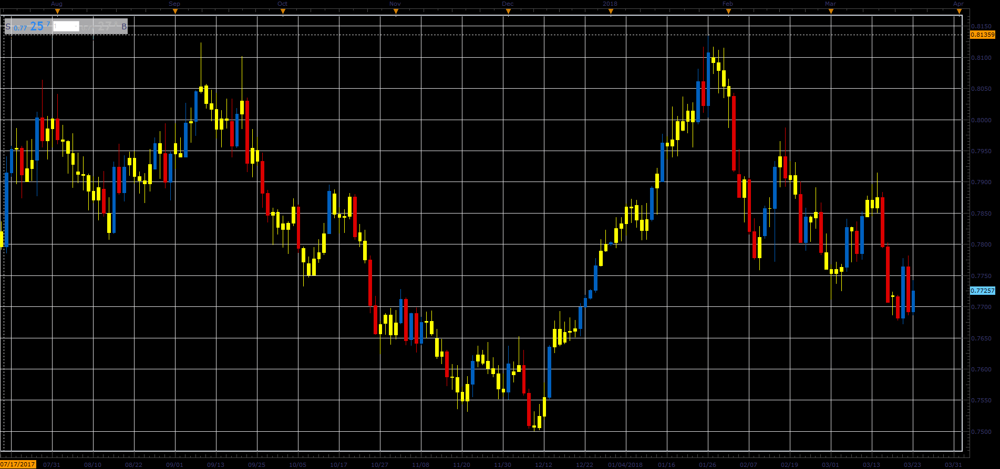

# Candles by size

> Source: https://fxcodebase.com/code/viewtopic.php?f=48&t=65926  
> Forum: 48 · Topic 65926 · 1 post(s)

---

## Candles by size

**Alexander.Gettinger** · Thu Apr 12, 2018 11:58 am

The indicator marks candle that match the criteria:
- High/Low more/less then level,
- Open-Close more/less then level.

 

Download:

 [Candles_By_Size_JS.jsl](files/118640/Candles_By_Size_JS.jsl)
