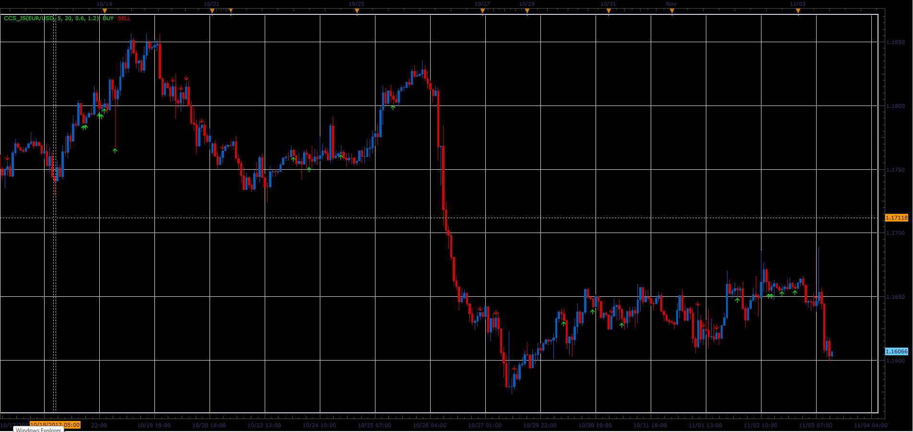

# Cash Cow Indicator

> Source: https://fxcodebase.com/code/viewtopic.php?f=48&t=65530  
> Forum: 48 · Topic 65530 · 1 post(s)

---

## Cash Cow Indicator

**Alexander.Gettinger** · Sat Jan 06, 2018 12:47 pm

Entry Signal (Long)
EMA (5) & EMA(20) are raising
EMA (5) > EMA (20)

Close > Lower 1.2% * Ema (5) Envelope
Close < Ema (5)

High < Upper 0.6% * Ema (5) Envelope
High > Ema (5)

Entry Signal (Short)
EMA (5) & EMA(20) are falling
EMA (5) < EMA (20)

Close < Higher 1.2% * Ema (5) Envelope
Close > Ema (5)

Low > Lower 0.6% * Ema (5) Envelope
Low < Ema (5)

 

Download:

 [CCS_JS.jsl](files/116809/CCS_JS.jsl)
