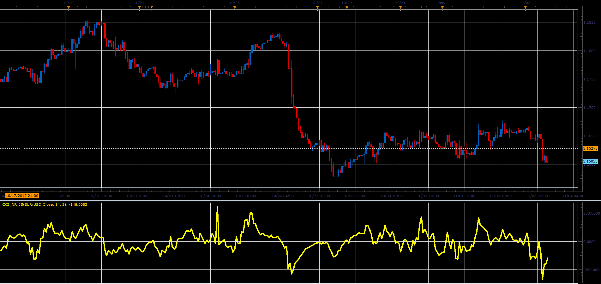

# CCI with noise reduction

> Source: https://fxcodebase.com/code/viewtopic.php?f=48&t=65528  
> Forum: 48 · Topic 65528 · 1 post(s)

---

## CCI with noise reduction

**Alexander.Gettinger** · Sat Jan 06, 2018 12:42 pm

The indicator is similar to the standard CCI, and has a sensitivity parameter that allows you to remove the weak oscillations.

 

Download:

 [CCI_NR_JS.jsl](files/116807/CCI_NR_JS.jsl)
