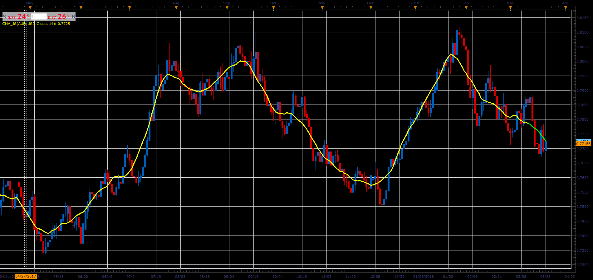

# Centred moving average

> Source: https://fxcodebase.com/code/viewtopic.php?f=48&t=65929  
> Forum: 48 · Topic 65929 · 1 post(s)

---

## Centred moving average

**Alexander.Gettinger** · Thu Apr 12, 2018 12:01 pm

This indicator is basically a simple moving average,
if compared with the original, there is a notable reduction in lag time,
last Period/2 values are just a projection of possible future SMA values.

 

Download:

 [CMA_JS.jsl](files/118643/CMA_JS.jsl)
