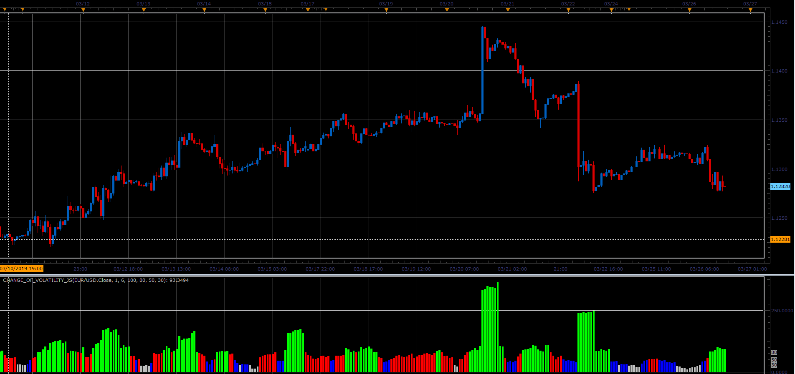

# Change of Volatility

> Source: https://fxcodebase.com/code/viewtopic.php?f=48&t=68204  
> Forum: 48 · Topic 68204 · 1 post(s)

---

## Change of Volatility

**Alexander.Gettinger** · Sat Mar 30, 2019 11:16 am

Formula:
CoV=100*StdDev(Short)/StdDev(Long), where
StdDev - standard deviation form Momentum indicator.

 

Download:

 [Change_Of_Volatility_JS.jsl](files/125423/Change_Of_Volatility_JS.jsl)
