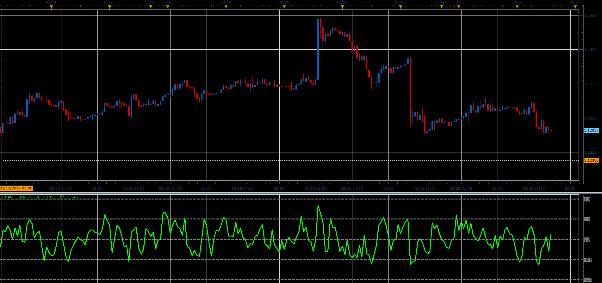

# Change ratio oscillator

> Source: https://fxcodebase.com/code/viewtopic.php?f=48&t=68205  
> Forum: 48 · Topic 68205 · 1 post(s)

---

## Change ratio oscillator

**Alexander.Gettinger** · Sat Mar 30, 2019 11:18 am

Formulas:
Change Ratio[i] = (Close[i]-Close[i-Period)/sum, where
sum = sum of Ratio from (i-Period+1) to i,
Ratio[i] = High[i]-Low[i].

 

Download:

 [Change_Ratio_JS.jsl](files/125424/Change_Ratio_JS.jsl)
