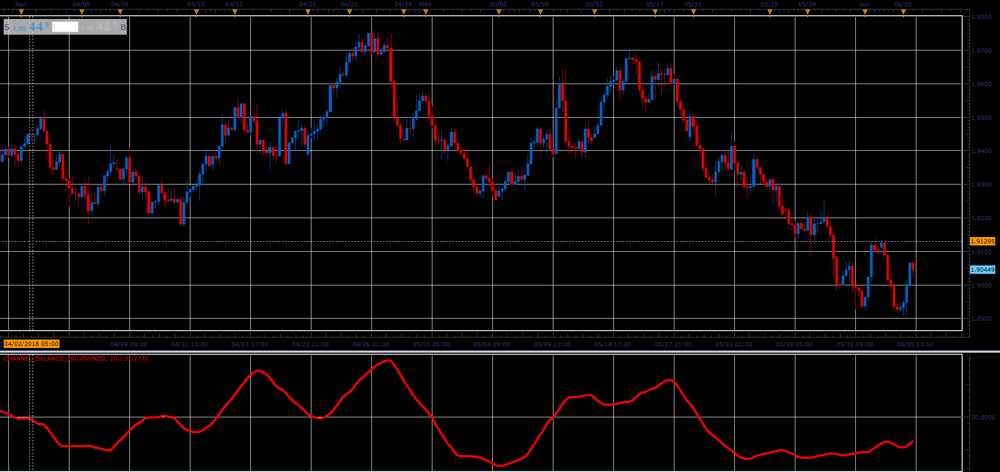

# Channel Balance

> Source: https://fxcodebase.com/code/viewtopic.php?f=48&t=66432  
> Forum: 48 · Topic 66432 · 1 post(s)

---

## Channel Balance

**Alexander.Gettinger** · Mon Aug 06, 2018 1:50 pm

Formula:
CB = 100*MVA(T), where
T = (Median price - Min)/Range,
Range = Max - Min,
Max, Min - maximum and minimum prices at range from (i-Length+1) to (i).

 

Download:

 [Channel_Balance_JS.jsl](files/120363/Channel_Balance_JS.jsl)
