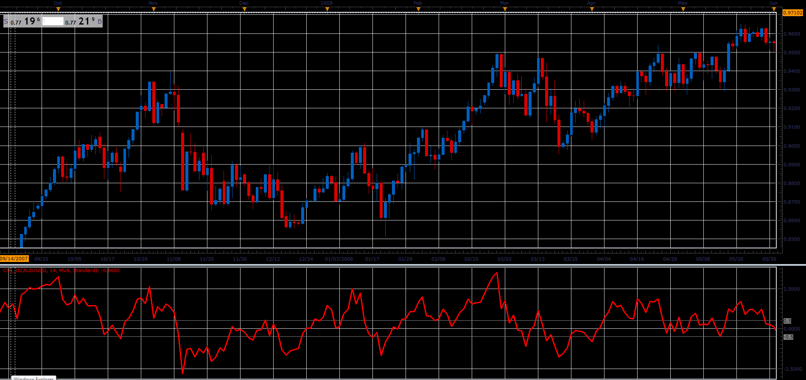

# Chartmill Value Indicator

> Source: https://fxcodebase.com/code/viewtopic.php?f=48&t=65978  
> Forum: 48 · Topic 65978 · 1 post(s)

---

## Chartmill Value Indicator

**Alexander.Gettinger** · Tue May 01, 2018 10:38 am

Formula:
CVI = (Close-VC)/ATR, where
VC = MA(Price) with [Length] number of periods and [Method] type,
ATR - Average True Range with [Length] number of periods.

 

Download:

 [CVI_JS.jsl](files/118903/CVI_JS.jsl)
