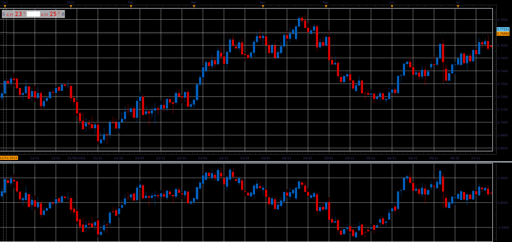

# Chartmill Value Indicator

> Source: https://fxcodebase.com/code/viewtopic.php?f=48&t=65931  
> Forum: 48 · Topic 65931 · 1 post(s)

---

## Chartmill Value Indicator

**Alexander.Gettinger** · Thu Apr 12, 2018 12:03 pm

Formulas:
C[i] = (Close[i]-MA)/ATR,
H[i] = (High[i]-MA)/ATR,
L[i] = (Low[i]-MA)/ATR,
O[i] = (Open[i]-MA)/ATR, where
MA = Moving average(Median Price, Length, Method),
ATR = Average True Range(Length).

 

Download:

 [CMVI_JS.jsl](files/118645/CMVI_JS.jsl)
