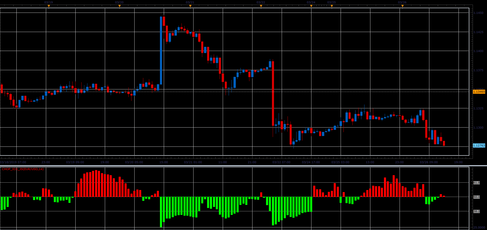

# Choppiness Index

> Source: https://fxcodebase.com/code/viewtopic.php?f=48&t=68259  
> Forum: 48 · Topic 68259 · 3 post(s)

---

## Choppiness Index

**Alexander.Gettinger** · Sat Mar 30, 2019 3:27 pm

The Choppiness Index is designed to measure the market's trendiness (values below 38.20) versus the market's choppiness (values above 61.80). When the indicator is reading values near 100, the market is considered to be in choppy consolidation. The lower the value of the Choppiness Index, the more the market is trending. The period supplied by the user dictates how many bars are used to compute the index.

 

Download:

 [chop_idx_JS.jsl](files/125479/chop_idx_JS.jsl)

---

## Re: Choppiness Index

**xristos1982** · Thu May 18, 2023 1:55 pm

Can i have this in lua,please?

---

## Re: Choppiness Index

**Apprentice** · Fri May 19, 2023 6:36 am

Try this version.
[https://fxcodebase.com/code/viewtopic.php?f=17&t=7115](https://fxcodebase.com/code/viewtopic.php?f=17&t=7115)
