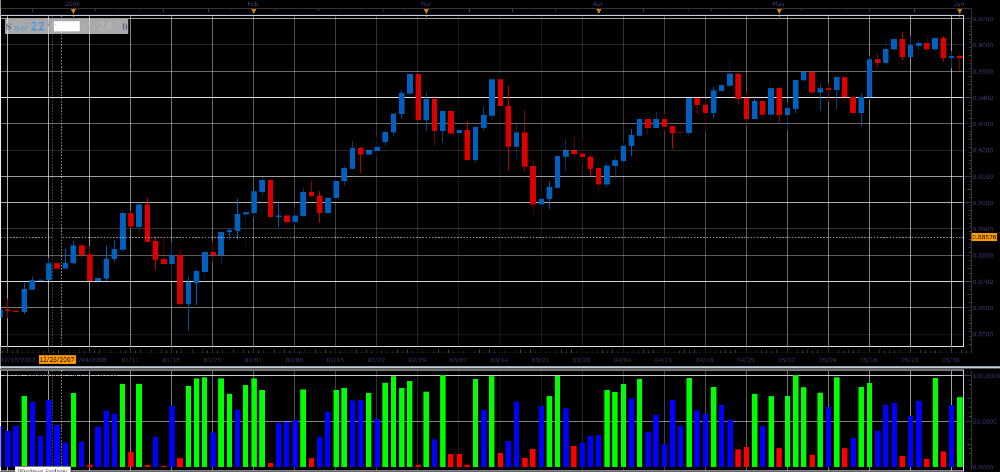

# Closing Price Position

> Source: https://fxcodebase.com/code/viewtopic.php?f=48&t=65933  
> Forum: 48 · Topic 65933 · 1 post(s)

---

## Closing Price Position

**Alexander.Gettinger** · Thu Apr 12, 2018 12:05 pm

The indicator shows the position of the closing price within the High / Low range of candles.

 

Download:

 [CPPO_JS.jsl](files/118647/CPPO_JS.jsl)
