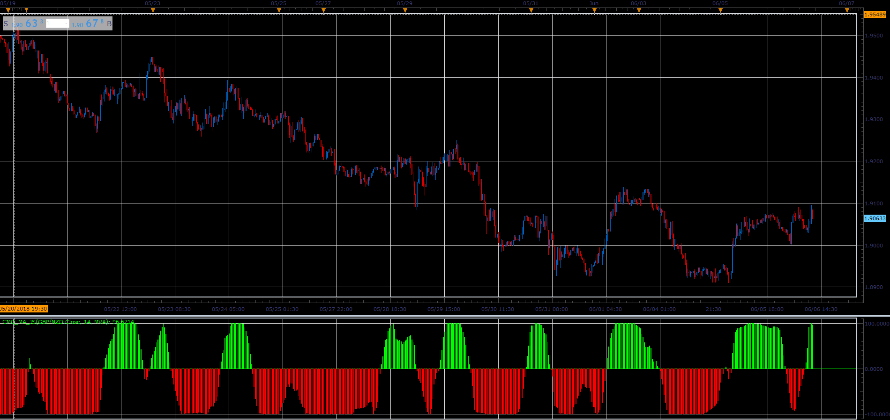

# CMO with MA indicator

> Source: https://fxcodebase.com/code/viewtopic.php?f=48&t=66517  
> Forum: 48 · Topic 66517 · 1 post(s)

---

## CMO with MA indicator

**Alexander.Gettinger** · Wed Aug 15, 2018 2:20 pm

Formulas:
CMO_MA[i]=100*(SumBulls-SumBears)/(SumBulls+SumBears), where
SumBulls and SumBears are a sum of a positive and negative values of (MA(i)-MA(i-1)).

 

Download:

 [CMO_MA_JS.jsl](files/120579/CMO_MA_JS.jsl)

For this indicator must be installed Averages indicator ([viewtopic.php?f=17&t=2430](https://fxcodebase.com/code/viewtopic.php?f=17&t=2430)).
