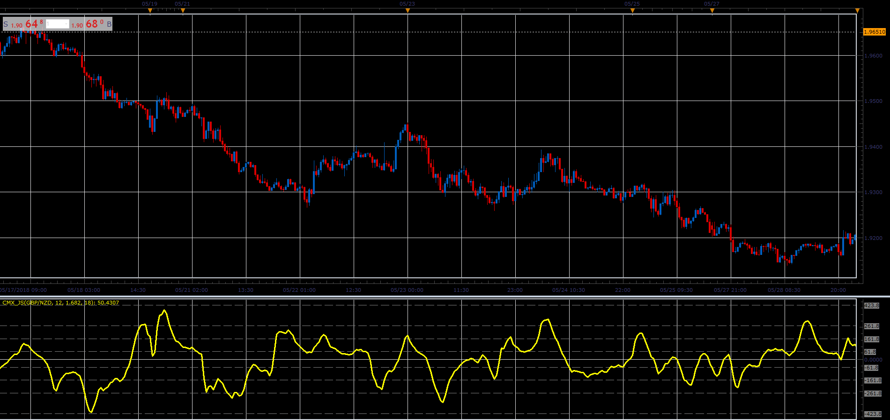

# CMx Oscillator

> Source: https://fxcodebase.com/code/viewtopic.php?f=48&t=66518  
> Forum: 48 · Topic 66518 · 1 post(s)

---

## CMx Oscillator

**Alexander.Gettinger** · Wed Aug 15, 2018 2:21 pm

The indicator is compilation of Moving Average, CCI, ADX и Fibonacci levels.

Formulas:
CMx[i] = CCI[i]*ADX[i]/(L*K), where
ADX[i] - Average Directional Movement Index with Period as Length,
CCI[i] = (Diff[i]-mean)/(meandev*0.015),
mean, meandev - mean and mean deviation of Diff at range from (i-K_Period+1) to i,
Diff[i] = EMA[i]-EMA_K[i],
EMA - exponential moving average with Period as Length,
EMA_K - exponential moving average with K_Period as Length,
K_Period = Period*K.

 

Download:

 [CMx_JS.jsl](files/120580/CMx_JS.jsl)
