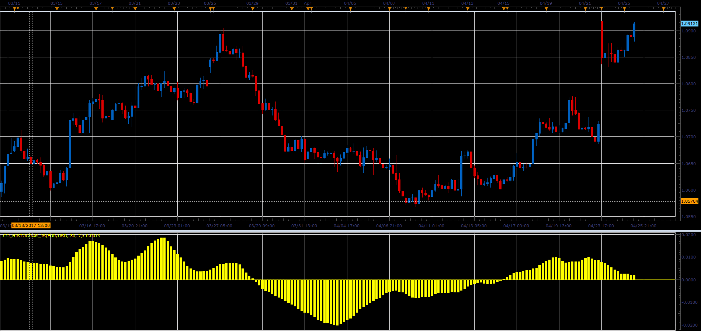

# CO histogram

> Source: https://fxcodebase.com/code/viewtopic.php?f=48&t=64706  
> Forum: 48 · Topic 64706 · 1 post(s)

---

## CO histogram

**Alexander.Gettinger** · Fri Jun 02, 2017 12:17 pm

Formula:
CO = MVA(T), where
MVA - simple moving average with [MA_Period] number of periods,
T = Sum(Close price) - Sum(Open price).

 

Download:

 [CO_Histogram_JS.jsl](files/112695/CO_Histogram_JS.jsl)
